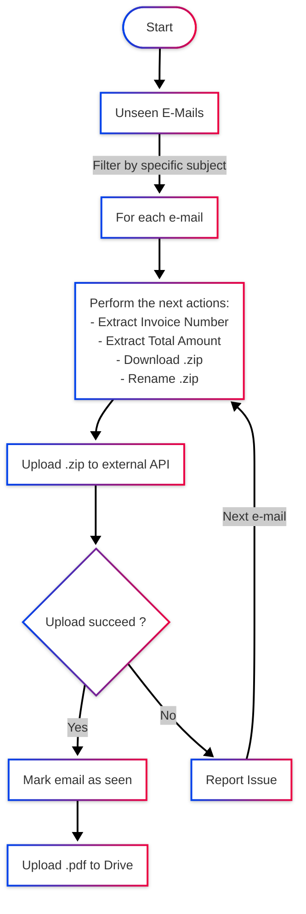

<h2 align="center">RPA Facturas</h2>
<h4 align="center">Business Process Automation for Invoices</h4>
<h2 align="center">

</h2>

## Overview 🤖

This project automates the process of reading invoices from an email inbox, extracting key information, uploading attachments to a specific API, and storing the processed data in Google Drive and Google Sheets. This Business Process Automation (BPA) is designed to streamline invoice management and reduce manual effort.

### Disclaimer

> This is a custom automation project built to meet the specific requirements of a client. The logic, API endpoints, and email formats are tailored to their unique workflow. If you are interested in a similar automation solution, feel free to reach out to me at alfareiza@gmail.com.

-----

## ✨ Key Features 

  * **Email Parsing**: Automatically reads and filters unread emails based on a specific subject format.
  * **Data Extraction**: Parses the email body to extract crucial invoice data like invoice number and total amount.
  * **API Integration**: Seamlessly interacts with the Mutual Ser API to upload invoice files.
  * **File Management**: Handles `.zip` and `.pdf` files, including extraction, renaming, and uploading to Google Drive.
  * **Reporting**: Generates a report of processed and unprocessed invoices and sends it to a Google Sheet.
  * **Error Handling**: Captures and reports any errors during the process by sending an email notification.

-----

## 🌊 Workflow Overview

The automation follows a sequential process to handle incoming invoices:

1.  **Read and Filter Emails**: The process starts by scanning the Gmail inbox for unread emails that match a predefined subject line format.
2.  **Extract Invoice Data**: For each filtered email, the automation extracts the invoice number and total amount from the email's body. The invoice date is derived from the email's received date.
3.  **Upload to API**: The attached `.zip` file from the email is uploaded to the Mutual Ser API.
4.  **Process and Store Files**: If the upload is successful, the `.zip` file is decompressed, the `.pdf` is extracted, renamed, and then uploaded to a designated Google Drive folder.
5.  **Update and Report**: The email is marked as read, and the processing status is logged in a Google Sheet.

-----

## 💻 Technologies Used

This project leverages a variety of powerful Python libraries and Google Cloud services to achieve its automation goals.

| Technology | Purpose |
| :--- | :--- |
| **Python** | The core programming language for the automation script. |
| **Requests** | Used for making HTTP requests to the Mutual Ser API. |
| **Pydantic** | For data validation and settings management. |
| **BeautifulSoup** | To parse HTML content from emails and extract data. |
| **Pandas** | For creating and managing data frames for reporting purposes. |
| **Unittests** | To ensure the reliability and correctness of the code through testing. |
| **Google Gmail API** | For reading emails and their attachments. |
| **Google Drive API** | For uploading and managing files in Google Drive. |
| **Google Sheets API** | For populating a spreadsheet with the results of the automation. |

-----

## ⚙️ Detailed Process

Here is a step by step breakdown of the automation's logic:

### 1\. Email Filtering and Reading

The automation scans the inbox with the following filters:

  * **Unread emails** only.
  * The subject line must follow the format: `"12345678;FOO BAR SAS;LGFM1520082;01;FOO BAR SAS"`. The text before the second semicolon is a constant.
  * It processes the **first 200 emails** that match these criteria.

### 2\. Data Extraction from Emails

For each email found, the following data points are extracted:

  * `<invoice_number>`: Extracted from the email body.
  * `<total>`: Extracted from the email body.
  * `<invoice_date>`: Taken from the received date of the email.

### 3\. API Interaction and File Handling

The script interacts with the customer API to upload the `.zip` file attached to the email.

  * **Login Check**: It first checks if a login to the API is required.
      * If **yes**, it performs the login.
      * If **no**, it proceeds to the next step.
  * **File Upload**: The `.zip` file is uploaded to the customer API.
  * **Success Check**:
      * If the upload is **successful**:
        1.  The `.zip` file is **decompressed**.
        2.  The `.pdf` file is **extracted**.
        3.  The `.pdf` is renamed to `<invoice_number>_<total>.pdf` (e.g., `LGFM1574823_545540.pdf`).
        4.  The renamed `.pdf` is uploaded to the `FacturasPDF` folder in Google Drive.
        5.  The email is marked as **read**.
      * If the upload **fails**:
        1.  An error message is captured.
        2.  An email notification is sent with the error details.

### 4\. Reporting

Finally, a report containing the status of all processed invoices (both successful and failed) is generated as a data frame and sent to a preconfigured Google Sheet.

## 📈 Process Flow Diagram

-----

## 📞 Contact

Alfonso - alfareiza@gmail.com
